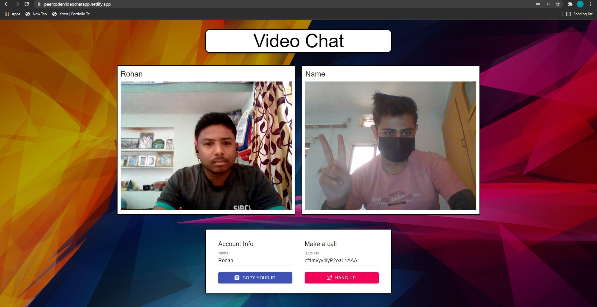

# [Video-Chat-Web-App](https://peercoder-videochat.netlify.app/) ⭐

&nbsp;
&nbsp;
&nbsp;
&nbsp;<br/>
&nbsp;
&nbsp;


[](https://peercoder-videochat.netlify.app/)
[](https://github.com/ROHAN842/Video-Chat-Web-app)

## Overview 👀


- Real time video chat 📹 with user 
- Clean UI ⚡

## What is Video Chatting Web App? 🤔

#### This is basically a video chatting web app whose front end is purely made with React.js while the back end is completely framed by using socket.io with node.js and express.js as server.


## How it works? 🤔
- **Open the website [https://peercodervideochatapp.netlify.app/](https://peercodervideochatapp.netlify.app/)**
- **For Video Chat, user just need to copy a unique id and send it to user with whom he/she want to chat.**

## Dependencies 🗃

- [React.js](https://reactjs.org/) - **Frontend Framework**
- [Node.js](https://nodejs.org/en/) - **Backend Framework**
- [Express.js](https://expressjs.com/) - **Server Side Node.js Framework**
- [Socket.io](https://socket.io/) - **Client-Server Communication**

## Run Locally 💻

```
> Clone the repo
    >> For Windows: Git Bash
    >> For Linux: Terminal
    >> git clone https://github.com/ROHAN842/Video-Chat-Web-app.git
    >> cd MainFolder/DirectoryName
> Install all dependencies
    >> npm i
> Split the terminal window into two parts 
> Spin the server on port 5000
    >> cd MainFolder/Directory
    >> nodemon or node index.js
> Spin the react on port 3000
    >> cd client
    >> npm start
> Visit the website on http://localhost:3000/
    
```
